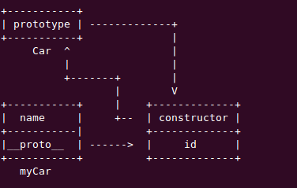

## new

new 操作符的作用是创建对象实例，可以是自定义的类型也可以是系统自带的类型。

创建一个自定义类型需要经过以下步骤：

1. 定义构造函数
2. 通过 new 来创建对象实例

下面举个例子来说明在创建对象实例的时候发生了什么：

当执行 `var myCar = new Car() `的时候:

+ 一个新的对象被创建出来，这个对象是Car.prototype 的实例。这一点可以查看下面这段示例：

```javascript
function Car(){}
Car.prototype.id = '#001';
var myCar = new Car();
console.log(myCar.id);  // #001
```

我们并没有在构造函数Car中做任何动作，在 new 之后，获得的实例得到了Car.prototype 的属性。

+ 执行构造函数 Car ，并且在构造函数内部将 this 指定为上个步骤构造出来的对象。

+ 构造函数执行完毕后如果没有返回一个对象，那么 new 的结果就是上两个步骤构造出来的对象，但是如果构造函数最后返回了一个对象，那么前两个步骤的结果也就被该对象覆盖了，最终 new 的结果将是返回的这个值。


new 得到的结果中共享构造函数的原型，所以如果给构造出来的某个对象添加一个属性，这只会影响它自身，但是如果希望给所有的实例添加一个属性，这个时候就可以给他们构造函数的实例对象添加一个属性。


这段代码给myCar实例添加了两个成员，一个位于自身，另一个位于原型中。

```
function Car(name){
		this.name = name;
}
Car.prototype.id = '#001';
var myCar = new Car('xxx');
```

如下图所示：



总结来说，使用 new 的时候发生了下面几个步骤：

1. 创建一个新对象
2. 将这个对象的__proto__ 指向函数的原型
3. 运行构造函数，并将构造函数中的 this 映射为 该元素。
4. 最后如果构造函数有返回值，而且返回值是对象，那么就返回这个对象。如果没有返回值，或者返回值不是对象，那么new的结果就是上面步骤构造出来的元素。
