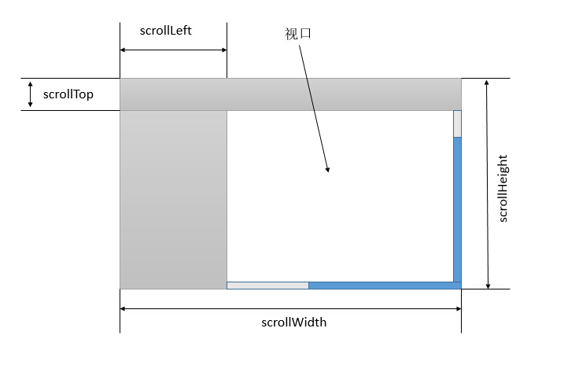

## 元素的 offset* ，client* 和 scroll* 属性

每个元素都用下面三组属性：

**offset**

+ offsetWidth
+ offsetHeight
+ offsetLeft
+ offsetTop
+ offsetParent

**client**

+ clientWidth
+ clientHeight
+ clientLeft
+ clientTop

**scroll**

+ scrollWidth
+ scrollHeight
+ scrollLeft
+ scrollTop

那么这些属性有都代表什么呢，之间有什么联系，有什么异常呢？

### offset

+ offsetWidth/offsetHeight

这两个属性表示元素的宽高，想必人人都明白盒子模型，这里的宽高，是指 content+padding+border 的宽高。**另外：**对于出现了滚动条的元素，这里的宽高还包括滚动条的宽度。

+ offsetLeft/offsetHeight

表示元素的左上角距离其第一个定位父辈元素的距离

+ offsetParent

表示元素的定位父辈元素。也就是该元素的第一个定位为非 `static` 的父辈元素。

### client

+ clientLeft/clientTop

这两个属性返回元素的内边框的外边缘距离外边框的内边缘的距离。也就是说这两个属性等于元素的左边框和上边框的宽度。

**需要注意的是：**对于内联元素，这两个属性均为 0 ;

+ clientWidth/clientHeight

这两个属性与 `offsetWidth` 与 `offsetHeight` 的区别在于这里的宽高并不包含元素的**边框的宽度**,也就是说这里的宽高是指 content+padding 的宽高。如果元素出现了滚动条，这里的也不包含滚动条的宽度。

下面这个图详细的描述了上面的部分属性。

### scroll

+ scrollLeft/scrollTop

当某些元素的内容太多的时候就可能出现滚动条，这个时候可以在元素的 `scrollLeft` 和 `scrollTop` 属性上面获得滚动条的位置。这两个属性还是可以写的，写这两个属性，可以让元素的滚动条滚动到指定位置。

+ scrollWidth/scrollHeight

获得元素的宽高，这里包含了不可见的部分。如下图所示：

