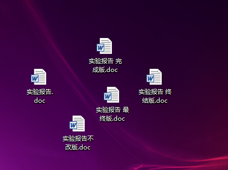

## 前言：我们为什么需要版本控制？

版本控制是一种记录若干文件内容变化，以便将来查阅特定版本修订情况的系统。在实际学习、工作中我们常常需要编辑一些文字，编一些代码，而且我们还要时常来修改他的内容，以让它更优雅。那么问题来了。当你修改完了以后，发现这些代码工作的并没有上一个版本工作的好，文章并不比上一个版本优雅。但是你已经找不到你之前的内容了。因为你关闭了编辑器，已经不能再Ctrl+ Z撤销所有操作了。就算可以，也足以让你眼花缭乱。我们该如何处理这样的问题呢？

其实我们经常在做版本控制，我们桌面上的“实验报告.doc”,“实验报告完成版.doc”,“实验报告最终版.doc”以及“实验报告不改版.doc”。最终我们的桌面就变成了这样:



这些就是我们为了控制版本所做的挣扎。一个文件还可以，但是联想到软件开发过程中，面对的是几千个文件不止，数以万行的内容。这样的方法可能实在拿不出台面。

我们需要的版本控制系统，可以保存所有版本的内容，在任意版本之间随意切换。又不会过于繁琐。对于一个外行的设计师搞乱了你的设计，一个糟糕的程序员，错误的修改了你的代码，却忘记了修改的地方，无意间删除了一个重要文件，这一切都不用过于恼怒，因为版本控制系统可以给我们解决这一切烦恼。如此一来我们的工作就会轻松很多，不会被繁杂的桌面，凌乱的文件夹所困扰，不会为菜鸟队友的错误修改而恼怒。但，要想体验这样的快乐，必然是要付出一定的代价的，那就是学会如何使用这样一个工具——git。

## Git 的基本使用

## 0. git 的基本概念

 
　　我们要使用的工具叫做git,是Linux 的缔造者 Linus Torvalds 在2005年开发出来用于管理，linux内核代码的工具，由于其令人难以置信的功能为人们广泛使用，是史上最强大的分布式版本控制系统。
### git的特点

+ 保存快照

Git 并不保存这些前后变化的差异数据。实际上，Git 更像是把变化的文件作快照后，记录在一个微型的文件系统中。每次提交更新时，它会纵览一遍所有文件的指纹信息并对文件作一快照，然后保存一个指向这次快照的索引。为提高性能，若文件没有变化，Git 不会再次保存，而只对上次保存的快照作一连接。

+ 分布式版本控制系统

git是史上最强大的分布式版本控制系统,没有之一。不同与集中式版本控制系统，几乎所有操作都需要联网操作。使用分布式版本控制系统，我们从服务器得到的是一个完整的代码库，里面包括所有版本的信息，你可以进行在本地进行几乎任何操作。在git中几乎所有的操作都只需要访问本地的文件。Git 在本地磁盘上就保存着所有有关当前项目的历史更新，你可以在任何时候查看当前版本与一个月之前的版本的差异。

+ 数据完整保存
　　在每一次递交到版本库时候,数据都将做校验,并且为每一次的操作标记一个唯一的标识。Git 使用 SHA-1 算法计算数据的校验和，通过对文件的内容或目录的结构计算出一个 SHA-1 哈希值，作为指纹字符串。该字串由 40 个十六进制字符（0-9 及 a-f）组成，像这 样`3ea8d2ef75557e7c7034067259bce2a7091ba1d7`,我们的d大多数操作只是向这个微型数据库里面添加数据，因为删除数据是一种不可逆的操作。所以放心使用，怎么样也不会搞丢数据的。

### 三种文件状态

对于任何一个文件，在 Git 内都只有三种状态：已提交（committed），已修改（modified）和已暂存（staged）。已提交：表示该文件已经被安全地保存在本地数据库中了；已修改：表示修改了某个文件，但还没有提交保存；已暂存：表示把已修改的文件放入将要提交到数据库的清单里。


## 1.初次运行前配置

### 配置用户名，用户邮箱

安装完成git以后用以后你需要打开git的命令行工具，输入下面内容：

```
$ git config --global user.name "Your Name"
$ git config --global user.email "email@example.com"
```

因为Git是分布式版本控制系统，所以需要填写用户名和邮箱作为一个标识,每次 Git 提交时都会引用这两条信息，说明是谁提交了更新，所以会随更新内容一起被永久纳入历史记录。其中的global参数，是说用户目录下的配置文件只适用于该用户，当然可以针对不同的仓库使用不同的配置。

### github上的趣事

值得注意的是大家熟知的github里面显示提交记录的时候会依据这个e-mail来判断是谁提交的，如果你设置成下面这样，那么就会显示Torvalds给你提交代码了。哈哈！

```
$ git config user.name "Linus Torvalds"
$ git config user.email "torvalds@linux-foundation.org"
$ git commit -m "Commiting as Linux Torvalds..."
```
github 上就会识别成是Torvalds干的 - -
因为 github 实际上是根据 user.email 识别的。

### **几种配置文件。**

+ /etc/gitconfig文件：系统中对所有用户都普遍适用的配置。若使用 git config 时用 --system 选项，读写的就是这个文件。

+ ~/.gitconfig文件：用户目录下的配置文件只适用于该用户。若使用 git config 时用 --global 选项，读写的就是这个文件。

+ 当前项目的 git 目录中的配置文件（也就是工作目录中的 .git/config 文件）：这里的配置仅仅针对当前项目有效。每一个级别的配置都会覆盖上层的相同配置，所以 .git/config 里的配置会覆盖 /etc/gitconfig中的同名变量。

你可以通过`git config --list `这个命令来查看配置。

也可以通过 `git config user.name`这样的命令来查看系统当前的某个变量

## 2. Git 基础操作

### 2.1 创建项目的 Git 仓库(git init)

执行:`$ git init`，初始化后，在当前目录下会出现一个名为 .git 的目录（隐藏的），所有 Git 需要的数据和资源都存放在这个目录中,随之一个仓库就建立好了。

### 2.2 克隆(git clone)

有的时候我们需要把别人的仓库复制过来，这个时候就需要用到克隆操作，因为这个仓库已经是存在的了，所以你不需要在执行初始化操作了，只需要知道这个仓库的地址就可以了

```
$ git clone git://github.com/schacon/grit.git
$ git clone git://github.com/schacon/grit.git mygrit    指定为自己设定的仓库名
```
### 2.3 查看仓库状况（git satus）

`$ git satus`

这个命令会告诉你当前仓库中文件的状态


### 2.4 向暂存区添加文件(git add) 

+ `$ git add [file name]`这一步骤也可以使用正则表达式来指定多个文件。例如`$ git add *.txt`可以添加所有的.txt为后缀的文件。

+ `$ git add .`你可以直接用一个点'.'来代替所有尚未暂存的文件

### 2.5 提交版本（git commit）

+ git commit -m "Story 182: Fix benchmarks for speed"

+ git commit -a -m 'added new benchmarks'   跳过add

如果不加-m git 会显示编辑器让你编辑备注

### 2.6 忽略某些文件（.gitignore）

一般我们总会有些文件无需纳入 Git 的管理，也不希望它们总出现在未跟踪文件列表。通常都是些自动生成的文件，像是日志或者编译过程中创建的等等。我们可以创建一个名为 .gitignore 的文件，列出要忽略的文件模式，我们看一下,当前一个.gitignore的内容:

```
*.[oa]
*~
```
　　第一行告诉 Git 忽略所有以 .o 或 .a 结尾的文件。一般这类对象文件和存档文件都是编译过程中出现的，我们用不着跟踪它们的版本。第二行告诉 Git 忽略所有以波浪符（~）结尾的文件，许多文本编辑软件（比如 Emacs）都用这样的文件名保存副本。此外，你可能还需要忽略 log，tmp 或者 pid 目录，以及自动生成的文档等等。要养成一开始就设置好 .gitignore 文件的习惯，以免将来误提交这类无用的文件。文件 .gitignore 的格式规范如下：


+ 所有空行或者以注释符号 ＃ 开头的行都会被 Git 忽略。
+ 可以使用标准的 glob 模式匹配。

**注：**所谓的 glob 模式是指 shell 所使用的简化了的正则表达式。星号（*）匹配零个或多个任意字符；[abc]匹配任何一个列在方括号中的字符（这个例子要么匹配一个 a，要么匹配一个 b，要么匹配一个 c）；问号（?）只匹配一个任意字符；如果在方括号中使用短划线分隔两个字符，表示所有在这两个字符范围内的都可以匹配（比如 [0-9] 表示匹配所有 0 到 9 的数字）。(来自百度百科)

+ 匹配模式最后跟反斜杠（/）说明要忽略的是目录。
+ 要忽略指定模式以外的文件或目录，可以在模式前加上惊叹号（!）取反。
　　下面是例子：
　
	+ \# 此为注释 – 将被 Git 忽略
	+ *.a # 忽略所有 .a 结尾的文件
	+ !lib.a # 但 lib.a 除外
	+ /TODO # 仅仅忽略项目根目录下的 TODO 文件，不包括 subdir/TODO
	+ build/ # 忽略 build/ 目录下的所有文件
	+ doc/*.txt # 会忽略 doc/notes.txt 但不包括 doc/server/arch.txt

### 2.7 查看差异(git diff)

+ 要查看**尚未暂存**的文件更新了哪些部分:`git diff`,直接输入不加参数的`git diff`结果向下图这样：


+ 若要看已经暂存起来的文件和上次提交时的快照之间的差异:用`git diff --cached`命令。（Git 1.6.1及更高版本还允许使用 `git diff --staged`，效果是相同的，但更好记些。）

+ 在版本提交之前可以看一下暂存区里某个文件的的内容和仓库里面的内容有什么差别:用 `git diff HEAD -- Reandme.txt`

`git diff`不过是显示还没有暂存起来的改动，而不是这次工作和上次提交之间的差异。所以有时候你一下子暂存了所有更新过的文件后，运行 `git diff` 后却什么也没有，就是这个原因。


### 2.8 移除文件（git rm）

+ 移除某个文件: 要从 Git 中移除某个文件,就要从已跟踪文件清单中移除（确切地说，是从暂存区域移除），然后提交。可以用 `git rm` 命令完成此项工作，并连带从工作目录中删除指定的文件，这样以后就不会出现在未跟踪文件清单中了。

+ 有的时候我们并不希望将文件删除，只是希望他不要被纳入跟踪文件清单，这个时候我们可以使用：`git rm --cached readme.txt` （移出暂存区但是不删除）


### 2.9 移动文件（git mv）

+ 在 Git 中对文件改名，可以这么做：`git mv file_1 file_2`
+ 移动文件：直接使用git mv 像常规的移动一样

如果在 Git 中重命名了某个文件，仓库中存储的元数据并不会体现出这是一次改名操作。因为是基于（哈希码来标记文件的）

'git mv' 就相当于运行了下面三条命令：

```
$ mv README.txt README
$ git rm README.txt
$ git add README
```

### 2.10查看提交历史(git log) 

+ `$ git log`
+ `$ git log –p -2`

我们常用 -p 选项展开显示每次提交的内容差异，用 -2 则仅显示最近的两次更新。

### 2.11 撤消操作

任何时候，你都有可能需要撤消刚才所做的某些操作。请注意，有些操作并不总是可以撤消的，所以请务必谨慎小心，一旦失误，就有可能丢失部分工作成果。

1. 修改最后一次提交：有时候我们提交完了才发现漏掉了几个文件没有加，或者提交信息写错了。想要撤消刚才的提交操作，可以使用 --amend 选项重新提交：`git commit --amend`，这个提交是使用当前的暂存区中的快照进行提交，所以可以将忘记暂存的内容使用git add 暂存起来，然后使用该命令。像下面这样：

```
$ git commit -m 'initial commit'
$ git add forgotten_file
$ git commit --amend
```

2. 取消暂存某个文件：`git reset HEAD <file>`

3. 取消对文件的修改(尚未提交到暂存区):`$ git checkout -- README.md`

4. 取消对文件的修改(已经提交到了暂存区)：这种情况我们可以使用上面两个步骤来完成，先取消暂存，现在就回到了，上面这个情况了。

5. 取消对文件的修改(已经提交到了版本库):当你已经把暂存区提交到了版本库,这个时候如果使用版本回退，回到上一个版本。你修改了多个文件，都会回到上一个版本的状态，你又只想回退其中一个文件，这个情况其实是和 4 中一样的，你依然只需要取消暂存，然后，撤销操作即可。不过此时你需要使用`git reset HEAD^ <file>`,因为是要还原成上一个版本嘛。其实这个时候版本库里面的内容没有变化。只是我们用上一个版本还原了工作区里这个文件的内容。


注：如果你误删了文件，那没事，版本库里还有呢，你可以使用  git checkout -- xxx.txt  就ok了。但是如果你删除的时候你已经修改了一些内容了，那么抱歉，没有进入暂存区的内容，很遗憾的就没有了。

### 2.12 操作远程仓库(git remote)

+ 查看当前的远程库
	+ git remote
	+ git remote -v  详细的 可以看到地址
	+ git remote show [remote-name]:查看某个远程仓库的详细信息
	 
+ 添加远程仓库:`$ git remote add pb git://github.com/paulboone/ticgit.git`

+ 从远程仓库抓取数据`$ git fetch [remote-name]`(前提是你已经添加了这个远程仓库)

+ 推送数据到远程仓库`git push [remote-name] [branch-name]`(如：`$ git push origin master`)

>> **注：**只有在所克隆的服务器上有写权限，或者同一时刻没有其他人在推数据，这条命令才会如期完成任务。如果在你推数据前，已经有其他人推送了若干更新，那你的推送操作就会被驳回。你必须先把他们的更新抓取到本地，并到自己的项目中，然后才可以再次推送。
	　　
+ 远程仓库的删除:`git remote rm paul`(碰到远端仓库服务器迁移，或者原来的克隆镜像不再使用，又或者某个参与者不再贡献代码，那么需要移除
对应的远端仓库)

+ 远程仓库的重命名:`git remote rename pb paul`(把 pb 改成 paul)	　　

**所以在本地建立一个库，之后要想它和远程库联系起来的步骤就是这样：**

1. 在本地使用`git init`建立一个库
2. 在github上面建立一个库
3. 添加这个远程库：`git remote add origin git@github.com:wy-ei/xxx.git`
4. 本地的文件要同步到远程库使用：`git push -u origin master `这里使用-u 是建立他们之间的联系,
5. 如果远程不是一个空仓库,里面含有 readme  licence 等东西,需要把他fetch下来,在本地merge,或是使用pull,之后再push

### 2.12 一些技巧

+ Git 命令别名

```
$ git config --global alias.co checkout
$ git config --global alias.br branch
$ git config --global alias.ci commit
$ git config --global alias.st status
```
现在，如果要输入 git commit 只需键入 git ci 即可

### 操作分支

删除远程分支：`git push origin --delete master`  删除远程分支，该分支不能是默认分支，如果是的话，需要去github或者对应的地方将其他分支设置为默认分支后在进行操作。
